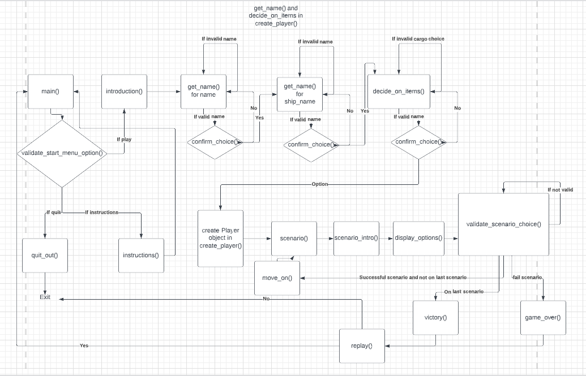

Welcome CarlG96,

This is the Code Institute student template for deploying your third portfolio project, the Python command-line project. The last update to this file was: **August 17, 2021**

## Reminders

* Your code must be placed in the `run.py` file
* Your dependencies must be placed in the `requirements.txt` file
* Do not edit any of the other files or your code may not deploy properly

## Creating the Heroku app

When you create the app, you will need to add two buildpacks from the _Settings_ tab. The ordering is as follows:

1. `heroku/python`
2. `heroku/nodejs`

You must then create a _Config Var_ called `PORT`. Set this to `8000`

If you have credentials, such as in the Love Sandwiches project, you must create another _Config Var_ called `CREDS` and paste the JSON into the value field.

Connect your GitHub repository and deploy as normal.

## Constraints

The deployment terminal is set to 80 columns by 24 rows. That means that each line of text needs to be 80 characters or less otherwise it will be wrapped onto a second line.

-----
Happy coding!

# Space Traveller

## Purpose of Space Traveller
Space Traveller is a text-based adventure game in a science fiction setting. The game receives input from the user and through this the user navigates through a number of scenarios, either passing them and moving on to the next one or failing. There are five scenarios the player must navigate through by inputting commands and completing all five of them will result in the user completing the game. The user will choose the name of their captain, their spaceship and will decide upon 3 of 5 'cargo' to hold on their ship to potentially use throughout the game.
## Features
* Start Menu
    * The player is taken to a start menu to begin with. Here they are prompted to choose between numbers 1-3 with details next to the numbers. 
    If the player inputs 1 they are taken to the introduction text of the game and then to create their player object.
    If the player inputs 2 they are taken to the instructions text and then back to the start menu.
    If the player inputs 3 they exit the application.
    If they input an invalid repsonse they are asked to input a valid response.

* Create Player
    * The player is asked to name their captain and their ship. The names must be between 4 and 15 alphanumeric characters without spaces and if they aren't the player is prompted to do this.
    * They are asked if these names are correct and if not this happens again in a loop but if so moves on to the player choosing what cargo they want. The player confirms there choice by responding by inputting 'Y' or 'N'. 
    * They are then asked to choose from five pieces of cargo with number inputs. The cargo list shrinks when taken from and choosing a non integer causes the game to ask the player to type an available number and typing an out of index number causes the game to tell the player what number range is available.
    * The player is asked if the cargo is good when they have selected three pieces and if they aren't the process starts again but if they are the player object is created using the captain name, ship name and the cargo chosen. The player object also has two methods which allow it to use fuel and take a chance in a scenario.

* Scenario 
    * The player is then taken to the scenario where they are given an introductory message and are given the options of what they can do in available numbers. 
    * Choosing an incorrect option will ask the player to type an integer if they create an index error or will give the range of integers available if the player's input is outside of index bounds.
    * Other than using available cargo items, the player can burn fuel (starts at 2 and decreases after every use) and take a risk with the two class methods of the player class.
    * Using the correct cargo item for the scenario clears the scenario but using the wrong one will fail it. It will also remove the cargo item from the player's options.
    * Burning fuel automatically passes the scenario but if fuel is 0 or below will fail the scenario. Burning fuel also reduces fuel amount by 1 each time.
    * Taking a chance returns a random integer between 1 and 10. If the player scores higher than the scenario's 'risk factor' then they succeed otherwise they fail. Each scenario increases the risk factor by 2; so scenario 1 is a 1 and always winnable but scenario 5 is a 9 and very risky for the player.
    * Succeeding in a scenario takes you to the next scenario or victory if all scenarios are complete but failing takes you to the game over.

* Victory and game over
    * Whether the player achieves victory or gets a game over, they will be asked if they want to replay the game. 
    * If they choose no they will exit the application.
    * If they choose yes they will be taken back to the start menu.
    * If they choose an option that is not 'Y' or 'N' they will be asked to provide an answer that is either 'Y' or 'N' (lowercases are capitalised).

## Future Features
There are many features I could think to add to the game in order to make it better but decided not to due to the fact it would become increasingly complex.

* Leaderboard on Google Sheet
    * I had thought about storing victorious player objects on an external Google Sheet linked via API. This would also allow me to use a function to display a leaderboard which would present things like Captain Name and Ship Name of those that had completed the game. This function would get data from the Google Sheet and display it on the terminal.
* More Methods and Cargo
    * I had considered making the player object creation more complex and the cargo could have been individual objects each with weights and methods and the player class could have had more methods that could have been called in scenarios but it would have only added to the complexity of the application and with only a terminal and no visual aspect may have been needlessly confusing for the player.
## Prototype and Flowcharts
* Lucidchart

## Technology
* Python
    * Used to create application with and display to terminal.
* Lucidchart
    * Used for the development of a flowchart to concept the ideas.
* GitHub 
    * Used for the repository and linked with Heroku to deploy the website.
* Gitpod
    * Used for development of the application.
* Heroku
    * Used for the deployment of the application.
## Testing
* PEP8 Validator
    * This application has been run through a PEP8 validator at [pep8online](http://pep8online.com/)
* Bug checking
    * This application has been tested to ensure that all possible scenarios are possible and that there are no obvious bugs.
    This includes testing for index errors and value errors and making sure exception handling is done well, and that each available
    option is available when the game offers it.
## Test Cases
## Bugs
## Deployment
## Credits